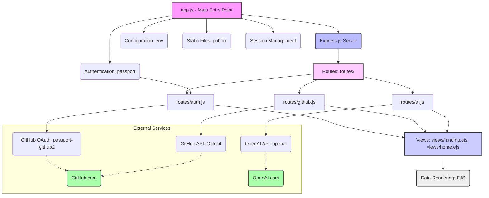

# Readme-Generator


[](http://www.passportjs.org/)
[](https://octokit.github.io/rest.js/)
[](https://vercel.com/)

## Description

Readme-Generator is a powerful web application designed to simplify the creation of comprehensive and high-quality `README.md` files for your GitHub repositories. Leveraging the GitHub API and Gemini's artificial intelligence, this application allows users to log in securely with their GitHub account, select a repository from their list, and automatically generate a contextual README based on its contents. The generated README can then be easily edited, previewed in real-time, and is ready for integration into your project.

This tool aims to save developers time and ensure consistency in their project documentation by providing an intelligent, automated starting point for repository descriptions, installation instructions, usage guides, and more.

**Live App**: [https://readme-generator-ai-app.vercel.app/](https://readme-generator-ai-app.vercel.app/)

## Features

*   **GitHub OAuth Integration**: Securely log in using your GitHub account.
*   **Repository Listing**: Easily view and select any of your public or private repositories.
*   **AI-Powered README Generation**: Utilize Gemini 2.5 flash models to generate a well-structured and relevant `README.md` based on your repository's files and folders.
*   **Contextual Analysis**: The application analyzes your repository's file structure and content to create a README tailored to your project.
*   **Markdown Editing Interface**: An intuitive editor to fine-tune the generated README.
*   **Live Preview**: Instantly see how your README will look with a real-time Markdown renderer.
*   **User-Friendly Interface**: A clean and easy-to-navigate web UI built with EJS templates and custom CSS.
*   **Vercel Deployment Ready**: Configured for seamless deployment on Vercel.

## Directory Structure
```
Readme-Generator/
├── public/
│   ├── icon/
│   │   └── icon.png
│   ├── home.css   
│   └── style.css
├── routes/
│   ├── ai.js
│   ├── auth.js
│   └── github.js
├── views/
│   ├── edit.ejs
│   ├── home.ejs
│   ├── landing.ejs
│   └── preview.ejs
├── app.js
├── package-lock.json
├── package.json
└── vercel.json
```

## Dependency Graph

The following diagram illustrates the main components and their dependencies within the `Readme-Generator` application:



## Installation

To get a local copy up and running, follow these steps.

### Prerequisites

Ensure you have the following installed:

*   [Node.js](https://nodejs.org/en/download/) (version 14 or higher recommended)
*   [npm](https://www.npmjs.com/get-npm) (comes with Node.js)
*   A GitHub account for OAuth.
*   A Gemini API key.

### Setup Steps

1.  **Clone the Repository:**
    ```bash
    git clone https://github.com/Kasa-Harendra/Readme-Generator.git
    cd Readme-Generator
    ```

2.  **Install Dependencies:**
    ```bash
    npm install
    ```

3.  **Create a `.env` file:**
    Create a file named `.env` in the root directory of the project and add the following environment variables. You will need to obtain these credentials:

    *   **GitHub OAuth Application:**
        1.  Go to [GitHub Developer Settings](https://github.com/settings/developers).
        2.  Click on "New OAuth App".
        3.  Fill in the application name (e.g., "Readme-Generator Local").
        4.  Homepage URL: `http://localhost:3000` (or your deployment URL).
        5.  Authorization callback URL: `http://localhost:3000/auth/github/callback` (or your deployment URL + `/auth/github/callback`).
        6.  After creation, you will get a `Client ID` and `Client Secret`.

    Your `.env` file should look like this:

    ```env
    PORT=3000
    GITHUB_CLIENT_ID=YOUR_GITHUB_CLIENT_ID
    GITHUB_CLIENT_SECRET=YOUR_GITHUB_CLIENT_SECRET
    OPENAI_API_KEY=YOUR_OPENAI_API_KEY
    SESSION_SECRET=A_VERY_LONG_RANDOM_STRING_FOR_SESSION_ENCRYPTION
    ```
    Replace the placeholder values with your actual keys and a strong, random string for `SESSION_SECRET`.

4.  **Start the Server:**
    ```bash
    npm start
    ```
    Alternatively, for development with hot-reloading (if `nodemon` is installed globally or as a dev dependency):
    ```bash
    npm run dev
    ```

5.  **Access the Application:**
    Open your web browser and navigate to `http://localhost:3000`.

## Usage

1.  **Landing Page:** Upon opening the application, you will be presented with a landing page (`views/landing.ejs`).
2.  **Login with GitHub:** Click on the "Login with GitHub" button. You will be redirected to GitHub to authorize the application.
3.  **Select Repository:** After successful authorization, you will be redirected to your dashboard (`views/home.ejs`) displaying a list of your GitHub repositories.
4.  **Generate README:** Select a repository from the list. The application will fetch its contents and send them to Gemini to generate a draft README.
5.  **Edit and Preview:** The generated README will be displayed in an editor (`views/edit.ejs`) where you can make changes. A live preview (`views/preview.ejs`) will show how the markdown will render.
6.  **Copy/Save:** Once satisfied, you can copy the markdown content to your clipboard or potentially save it directly (functionality for direct saving to GitHub might be extended in the future, currently, it focuses on content generation).

## Contribution Guidelines

Contributions are what make the open-source community such an amazing place to learn, inspire, and create. Any contributions you make are **greatly appreciated**.

If you have a suggestion that would make this better, please fork the repo and create a pull request. You can also open an issue with the tag "enhancement".

1.  Fork the Project
2.  Create your Feature Branch (`git checkout -b feature/AmazingFeature`)
3.  Commit your Changes (`git commit -m 'Add some AmazingFeature'`)
4.  Push to the Branch (`git push origin feature/AmazingFeature`)
5.  Open a Pull Request

---

Project Link: [https://github.com/Kasa-Harendra/Readme-Generator](https://github.com/Kasa-Harendra/Readme-Generator)


